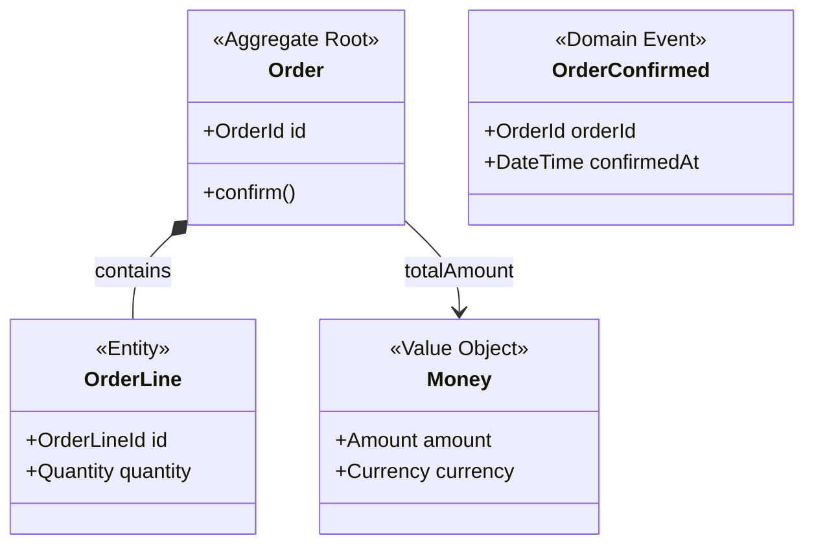

# Skill: domain-model

Purpose: maintain a project's DDD domain model — capture structural patterns from conversation, generate `docs/models/<context-kebab>.md` (Mermaid + 5 tables), and keep `docs/models/index.md` in sync. Applies when the conversation surfaces aggregates, entities, value objects, domain events, or invariants, or when asked to create/update a model. Grounded in Evans' Domain-Driven Design tactical patterns.

**Language**: Respond in the language of the current conversation. All examples in this file are in English; adapt to the conversation language at runtime.

---

## Pre-check

At every invocation:

1. Determine the target Bounded Context from the user message or conversation context. If not determinable, ask:

   > "Which context's domain model would you like to work on? (e.g., order, inventory, payment)"

2. Check whether `docs/models/<context-kebab>.md` exists.
   - Absent → **Bootstrap Flow**
   - Present → **Maintenance/Update Flow**

3. If `docs/ubiquitous-language.md` exists: read it and load all entries into the candidate queue (see UL Integration).

4. Maintain an in-session candidate queue (not persisted to disk):

   | Field | Description |
   |---|---|
   | `candidate_term` | Detected concept name |
   | `source_text` | Source sentence (quoted) |
   | `trigger_type` | `aggregate` / `entity` / `value-object` / `domain-event` / `invariant` |
   | `detected_at` | Conversation turn number |
   | `context` | Inferred Bounded Context name (`"unknown"` if unclear) |

---

## Beginner Assist

Support users unfamiliar with DDD terminology without disrupting experienced users.

### Plain-language glossary

| DDD Term | Plain meaning |
|---|---|
| Aggregate | A cluster of objects that always change together |
| Aggregate Root | The single entry point for the cluster; outside code may only access the cluster through this |
| Entity | Something identified by an ID; it can change over time but remains the same thing |
| Value Object | Something identified by its value; replace it entirely to "change" it (e.g., money, address) |
| Domain Event | A record of something that happened in the business; always named in past tense |
| Invariant | A rule the aggregate must enforce at all times; a state that violates it must never exist |
| Bounded Context | A named boundary within which a term has a specific, agreed meaning |

### Beginner signal detection

If the user shows any of the following, provide a brief plain-language explanation before proceeding:
- Expressions of confusion: "I don't understand," "What does that mean?", "This is hard"
- Misuse of DDD terms (e.g., treating "aggregate" as synonymous with "table")
- Vague answers to Bootstrap questions (e.g., "All of them?", "I'm not sure")

Explanation template:
> "[DDD term] means [plain meaning]. Think of [concrete example]."

### Augmented Bootstrap questions

Append a plain-language supplement to each Bootstrap step prompt:

**Step 1 — Aggregates**:
> "What clusters of data always change together in this context? (In DDD, these are called aggregates.)
> Example: An 'Order' is one cluster — the order itself, its line items, and the shipping address all change as a unit.
> What clusters exist in your system?"

**Step 2 — Entity vs. Value Object**:
> "Within [aggregate], classify each piece:
> - **Identified by an ID** — Even if details change, it is the same thing (Entity). Example: a specific order line.
> - **Identified by value** — Two instances with the same value are interchangeable (Value Object). Example: a monetary amount, an address.
> Which category does each piece in [aggregate] belong to?"

**Step 3 — Domain Events**:
> "What business occurrences happen during [aggregate]'s lifecycle? (In DDD, these are Domain Events — always named in past tense.)
> Examples: OrderConfirmed, PaymentReceived, StockReserved.
> Tip: think of status changes displayed on screen, or moments when a notification is triggered."

**Step 4 — Invariants**:
> "What rules must [aggregate] always enforce? (In DDD, these are Invariants — a state that violates them must never exist.)
> Examples: 'An order cannot be placed when stock is zero.' 'A cart total must never be negative.'
> Tip: look for 'cannot,' 'must always,' or 'is only allowed when' in your business rules."

---

## Passive Collection

During any conversation turn, **without interrupting the response**, monitor user messages for DDD structural patterns:

| Pattern | Example | trigger_type |
|---|---|---|
| "X has/contains Y", "Y belongs to X", "X aggregates Y" | "An order has multiple line items" | `aggregate` |
| "X ID", "X number", "X code" uniquely identifies | "Identified by order ID" | `entity` |
| "immutable", "replaced entirely", "equal if same value" | "Address is immutable" | `value-object` |
| Past-tense or passive verb+noun (business occurrence) | "Order was confirmed" | `domain-event` |
| "cannot when", "must always", "is required to" | "Cannot order when stock is zero" | `invariant` |

**False-positive guard**: queue a candidate only when the surrounding context contains at least one UL-registered term or another DDD pattern in the same turn.

**Surface queued candidates as a batch when**:
- Queue has ≥ 1 entry, AND
- The preceding turn contained no new DDD candidates

Batch proposal format:

```
## Domain Model — Candidates Detected

The following DDD pattern candidates were detected. Please review:

| # | Term | Source | Type | Context |
|---|---|---|---|---|
| 1 | Order | "An order has multiple line items" | aggregate | order |
| 2 | OrderId | "Identified by order ID" | entity | order |
| 3 | Cannot order when stock is zero | (verbatim) | invariant | order |

Reply: "Accept all" / "1 and 3 only" / "Skip" / "2 is value-object, not entity"
```

Accepted candidates seed the next Bootstrap or Update flow.

---

## Bootstrap Flow

**Trigger**: `docs/models/<context-kebab>.md` does not exist.

### Step 1 — Announce and elicit aggregates

Announce that no model file exists and that the bootstrap process is starting. Then use the augmented Step 1 prompt from Beginner Assist.

### Step 2 — Entity / Value Object classification

For each aggregate identified, use the augmented Step 2 prompt from Beginner Assist.

### Step 3 — Domain Event enumeration

Ask which business occurrences happen during the aggregate's lifecycle. Use the augmented Step 3 prompt. If UL-registered event names exist, propose them as authoritative and do not rename them.

### Step 4 — Invariant confirmation

Use the augmented Step 4 prompt from Beginner Assist.

### Step 5 — Generate diff and confirm

1. Build the full content of `docs/models/<context-kebab>.md` using `context-template.md` as the base.
2. Generate the Mermaid classDiagram from the collected tables (see Mermaid Generation Rules).
3. Present the complete proposed file content to the user.

**Do not write any file until the user explicitly confirms.**

On confirmation:
- Create `docs/models/` if absent.
- Write `docs/models/<context-kebab>.md`.
- Sync `docs/models/index.md` (see Index Sync).

---

## Maintenance/Update Flow

**Trigger**: `docs/models/<context-kebab>.md` exists.

### Step 1 — Read existing file

Read the full contents of `docs/models/<context-kebab>.md`.

### Step 2 — Determine changes

Based on queued candidates and/or the user's explicit instruction, identify what to add or update: new aggregates, entities, value objects, domain events, or invariants; or modifications to existing rows.

### Step 3 — Detect Mermaid / table divergence

After computing changes, verify that the classDiagram is consistent with the updated tables. If divergence is found:

> "The diagram is out of sync with the tables. Regenerate it?"

Regenerate if the user confirms.

### Step 4 — Show diff and confirm

Present a diff of all proposed changes (tables + diagram if regenerated).

**Do not write any file until the user explicitly confirms.**

**No-change rule**: if the proposed content is identical to the current file, do not write:

> "No changes detected. The file was not updated."

On confirmation: write `docs/models/<context-kebab>.md`, then sync `docs/models/index.md`.

---

## Mermaid Generation Rules

When generating or regenerating the `classDiagram` block:

**Stereotypes**:
- Aggregate Root → `<<Aggregate Root>>`
- Entity → `<<Entity>>`
- Value Object → `<<Value Object>>`
- Domain Event → `<<Domain Event>>`

**Relationships**:
- Aggregate contains Entity/VO → `AggregateRoot *-- Member : contains` (composition)
- Aggregate references another aggregate → `AggregateA --> AggregateB : refName` (association)

**Example**:



Include only key fields (identifier + 1–3 significant attributes) and primary operations. Full detail lives in the tables.

---

## UL Integration

**When `docs/ubiquitous-language.md` exists**:

1. Read all entries at Pre-check time.
2. Infer each entry's DDD pattern and add to the candidate queue:
   - Past-tense verb+noun → `domain-event`
   - Noun with ID reference → `entity`
   - Noun described as immutable or value-based → `value-object`
   - Noun described as containing or managing others → `aggregate`
   - Rule or constraint → `invariant`
3. When eliciting Domain Events (Bootstrap Step 3 or Maintenance Step 2), propose UL-registered names as authoritative. Do not rename or override them.
4. **This skill never writes to `docs/ubiquitous-language.md`** — it is read-only.

**When `docs/ubiquitous-language.md` does not exist**:

Run Bootstrap Flow without UL seed candidates (independent mode).

---

## Index Sync

Sync `docs/models/index.md` whenever a context file is written.

### On context file creation

1. If `docs/models/index.md` does not exist: create it from `index-template.md`.
2. Add a new row to the Bounded Contexts table: display name, file link, aggregate count, today's date.
3. Increment `Total Contexts`; update `Last Updated`.

### On context file update

Update the matching row (aggregate count, date) and `Last Updated`.

### On context file deletion (user-initiated)

1. Remove the matching row; decrement `Total Contexts`; update `Last Updated`.
2. Remove any edges referencing the deleted context from the Mermaid graph and relationship table; notify the user.

### Inter-context relationship diagram

The `graph LR` block and relationship table in `index.md` are optional. Populate them when the user describes cross-context relationships. Use DDD integration pattern labels:

```
U / D  — Upstream / Downstream
ACL    — Anti-Corruption Layer
OHS    — Open Host Service
CF     — Conformist
P      — Partnership
```

Example edge: `OrderContext --"U→D / ACL"--> InventoryContext`

---

## Cross-context Conflict Resolution

When the same concept name appears in two or more context files with differing semantics:

1. Surface the conflict:

   > "The concept '[name]' is defined in both [Context A] and [Context B] with different meanings. How would you like to resolve this?"

2. Present options:
   - **Separate** — Keep distinct entries per context; differentiate via implementation name (e.g., `OrderItem` vs. `InventoryItem`).
   - **Rename** — Rename the concept in one context; the user specifies the new name.

3. Apply the resolution and update both context files and `index.md` as a single confirmed diff.

**Silent merge is prohibited**: never unify concepts across contexts without explicit user confirmation.

---

## Invariants

1. **Diff before write**: Every file write is preceded by presenting the proposed content or diff.
2. **Explicit confirmation**: No file is written without explicit user confirmation.
3. **No silent cross-context merge**: Concept conflicts always surface the split-or-rename choice.
4. **Single file per Bounded Context**: One `docs/models/<context-kebab>.md` per BC; mixed-context content is prohibited.
5. **Index always reflects files**: `docs/models/index.md` is synced on every context file creation, update, or deletion.
6. **Diagram derived from tables**: The classDiagram is always generated from the tables, never edited independently.
7. **Language follows conversation**: Respond in the language the user is using; adapt all prompts and output accordingly.
