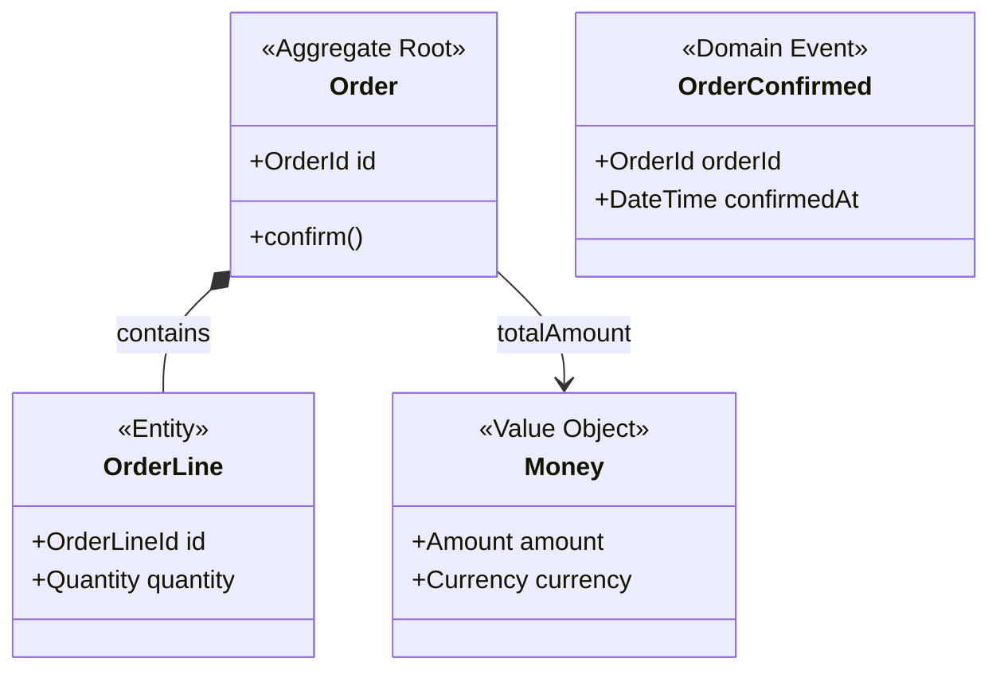

# Skill: domain-model

Maintain a project's DDD domain model — capture structural patterns from conversation, generate `docs/models/<context-kebab>.md` (Mermaid + 5 tables), and keep `docs/models/index.md` in sync.

---

## Pre-check

At every invocation, first:

1. Determine the target Bounded Context from user message or conversation. If not determinable, ask:

   > 「どのコンテキストのドメインモデルを操作しますか？（例: order / inventory / payment）」

2. Check whether `docs/models/<context-kebab>.md` exists in the current project root.
   - Absent → **Bootstrap Flow**
   - Present → **Maintenance/Update Flow**

3. If `docs/ubiquitous-language.md` exists: read it and load all entries into the candidate queue as context (UL Integration — see below).

4. Maintain an in-session candidate queue (not persisted to disk):

   | Field | Description |
   |---|---|
   | `candidate_term` | Detected concept name |
   | `source_text` | Source sentence (quoted) |
   | `trigger_type` | `aggregate` / `entity` / `value-object` / `domain-event` / `invariant` |
   | `detected_at` | Conversation turn number |
   | `context` | Inferred Bounded Context name (`"unknown"` if unclear) |

---

## Passive Collection

During any conversation turn, **without interrupting the current response**, monitor user messages for DDD structural patterns:

| Pattern | Example | trigger_type |
|---|---|---|
| 「〇〇は〇〇を持つ」「〇〇に属する」「〇〇を集約する」 | 「注文は複数の明細を持つ」 | `aggregate` |
| 「〇〇ID」「〇〇番号」「〇〇コード」で一意識別 | 「注文IDで一意に識別される」 | `entity` |
| 「変更されない」「置き換えられる」「同値なら同一」 | 「住所は変更されない」 | `value-object` |
| 動詞+名詞の過去形/受動形（業務上の出来事） | 「注文が確定された」 | `domain-event` |
| 「〜の場合は〜できない」「〜でなければならない」「〜は必ず〜」 | 「在庫がゼロの場合は注文できない」 | `invariant` |

**False-positive guard**: only queue a candidate when the preceding text context contains at least one of: a UL-registered term, or another DDD pattern in the same turn.

**Queue rule**: add without interrupting the conversation. Do not surface until the presentation condition is met.

**Surface queued candidates as a batch proposal when**:
- Queue has ≥ 1 entry, AND
- The preceding conversation turn contained zero new DDD vocabulary candidates

Batch proposal format:

```
## Domain Model — 候補検出

以下の DDD パターン候補を検出しました。確認をお願いします:

| # | 用語 | 検出元 | 候補タイプ | コンテキスト |
|---|---|---|---|---|
| 1 | 注文 | 「注文は複数の明細を持つ」 | aggregate | order |
| 2 | 注文ID | 「注文IDで一意に識別される」 | entity | order |
| 3 | 在庫がゼロの場合は注文できない | （原文）| invariant | order |

回答例: "全て採用" / "1,3のみ" / "スキップ" / "2は entity ではなく value-object"
```

Accepted candidates are used as seed input for the next Bootstrap or Update flow invocation.

---

## Bootstrap Flow

**Trigger**: `docs/models/<context-kebab>.md` does not exist.

### Step 1 — Announce and elicit aggregates

> 「このコンテキストのドメインモデルファイルはまだありません。ヒアリングを開始します。」

Ask:

> 「このコンテキストで整合性の単位（まとめて変わるもの）は何ですか？  
> 例: 注文、請求書、カート」

### Step 2 — Entity / Value Object classification

For each aggregate identified, ask:

> 「[集約名] の中で、識別子（ID）で区別するものはどれですか？（→ Entity）  
> 値で区別するもの（住所、金額など変更不可の概念）はどれですか？（→ Value Object）」

### Step 3 — Domain Event enumeration

> 「[集約名] のライフサイクルで起きる業務上の出来事は何ですか？  
> （UL に登録済みのイベント名がある場合はそちらを参照します）」

### Step 4 — Invariant confirmation

> 「[集約名] が常に守らなければならないビジネスルールは何ですか？  
> 例: 在庫がゼロの場合は注文できない」

### Step 5 — Generate diff and confirm

1. Build the full content of `docs/models/<context-kebab>.md` using `context-template.md` as the base.
2. Generate the Mermaid classDiagram from the collected tables (see Mermaid Generation Rules below).
3. Show the complete proposed file contents as a diff to the user.

**Do NOT write any file until the user explicitly confirms.**

On confirmation:
- Create `docs/models/` if absent.
- Write `docs/models/<context-kebab>.md`.
- Sync `docs/models/index.md` (see Index Sync section).

---

## Maintenance/Update Flow

**Trigger**: `docs/models/<context-kebab>.md` exists.

### Step 1 — Read existing file

Read the full contents of `docs/models/<context-kebab>.md` to establish the current state.

### Step 2 — Determine changes

Based on queued candidates and/or user's explicit instruction, identify what needs to change:
- New aggregates, entities, VOs, domain events, or invariants to add
- Existing rows to update

### Step 3 — Detect Mermaid / table divergence

After computing changes, check whether the Mermaid classDiagram in the file is consistent with the updated tables. If divergence is detected:

> 「図がテーブルと一致しません。再生成しますか？」

Regenerate diagram if confirmed.

### Step 4 — Show diff and confirm

Show a diff of all proposed changes (tables + diagram if regenerated).

**Do NOT write any file until the user explicitly confirms.**

**No-change rule**: if the proposed content is identical to the current file, do not write and inform the user:

> 「変更内容がありません。ファイルは更新しませんでした。」

On confirmation: write `docs/models/<context-kebab>.md`, then sync `docs/models/index.md`.

---

## Mermaid Generation Rules

When generating or regenerating the `classDiagram` block from the tables:

**Stereotypes**:
- Aggregate Root → `<<Aggregate Root>>`
- Entity → `<<Entity>>`
- Value Object → `<<Value Object>>`
- Domain Event → `<<Domain Event>>`

**Relationships**:
- Aggregate contains Entity/VO → `AggregateRoot *-- Member : contains` (composition)
- Aggregate references another aggregate → `AggregateA --> AggregateB : refName` (association)

**Example**:



List only key fields (identifier + 1-3 significant attributes) and primary operations. Keep the diagram readable; full details live in the tables.

---

## UL Integration

**When `docs/ubiquitous-language.md` exists**:

1. Read all UL entries at Pre-check time.
2. For each entry, determine its DDD pattern from the entry type / definition and add to the candidate queue:
   - Business event (過去形 verb+noun) → `domain-event`
   - Noun with ID reference → `entity`
   - Noun described as immutable / value-based → `value-object`
   - Noun described as containing/managing others → `aggregate`
   - Rule / constraint → `invariant`
3. When eliciting Domain Events in Bootstrap Step 3 or Maintenance Step 2: propose UL-registered event names as the authoritative naming. Do not rename or override UL event names.
4. **This skill never writes to `docs/ubiquitous-language.md`** — it is read-only from this skill's perspective.

**When `docs/ubiquitous-language.md` does not exist**:

Operate in independent bootstrap mode — run Bootstrap Flow without UL seed candidates.

---

## Index Sync

Whenever `docs/models/<context-kebab>.md` is written (created or updated), also sync `docs/models/index.md`:

### On context file creation

1. If `docs/models/index.md` does not exist: create it from `index-template.md`.
2. Add a new row to the Bounded Contexts table:
   - コンテキスト名: display name
   - ファイル: `[<name>](./<context-kebab>.md)`
   - 集約数: count from the Aggregates table
   - 更新日: today's date (YYYY-MM-DD)
3. Increment `Total Contexts` in the header.
4. Update `Last Updated`.

### On context file update

1. Update the matching row in the Bounded Contexts table (集約数, 更新日).
2. Update `Last Updated`.

### On context file deletion (user-initiated)

1. Remove the matching row from the Bounded Contexts table.
2. Decrement `Total Contexts`.
3. Update `Last Updated`.
4. If the deleted context appeared in the Mermaid graph or relationship table, remove those edges and inform the user.

### Inter-context relationship diagram

The `graph LR` Mermaid block and the relationship table in `index.md` are optional. Populate them when the user describes cross-context relationships. Use DDD integration pattern labels:

```
U (Upstream) / D (Downstream)
ACL (Anti-Corruption Layer)
OHS (Open Host Service)
CF (Conformist)
P (Partnership)
```

Example edge: `OrderContext --"U→D / ACL"--> InventoryContext`

---

## Cross-context Conflict Resolution

When the same concept name appears in two or more context files with differing semantics:

1. Surface the conflict explicitly:

   > 「「[概念名]」が [Context A] と [Context B] の両方に定義されており、内容が異なります。どうしますか？」

2. Present options:
   - **分離**: Keep separate entries per context; differentiate by `実装名` (e.g., `OrderItem` vs `InventoryItem`)
   - **改名**: Rename the concept in one context (user specifies the new name)

3. Apply the chosen resolution and update both context files and `index.md` as a single confirmed diff.

**Silent merge is prohibited**: never unify concepts across contexts without explicit user confirmation.

---

## Invariants

1. **Diff before write**: Every file write is preceded by showing the user the full proposed content or diff.
2. **Explicit confirmation**: No file is written without explicit user confirmation.
3. **No silent cross-context merge**: Concept conflicts always present the split-or-rename choice; never silently merge.
4. **Single-file per Bounded Context**: One `docs/models/<context-kebab>.md` per BC. Mixed-context content in one file is prohibited.
5. **Index always reflects files**: `docs/models/index.md` is synced on every context file creation, update, or deletion.
6. **Diagram generated from tables**: The Mermaid classDiagram is always derived from the tables, never edited independently. Table-first; diagram is a projection.
7. **Japanese output**: All user-facing output (questions, diff presentations, proposals, file content) must be presented in Japanese.
