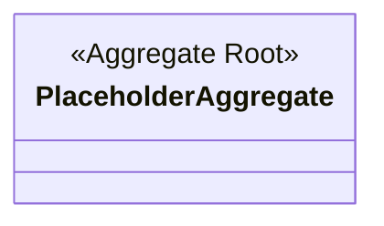

# Domain Model: {{Context Name}}

**Context**: {{Context Name}}
**Last Updated**: {{YYYY-MM-DD}}
**Index**: [index](./index.md)

---

## Class Diagram

---

## Aggregates

| 集約名 | 集約ルート | 責務 | 境界 | 不変条件 | ライフサイクル | 実装名 |
|---|---|---|---|---|---|---|
|  |  |  |  |  |  |  |

---

## Entities

| エンティティ名 | 識別子 | 属性 | 振る舞い | 所属集約 | 実装名 |
|---|---|---|---|---|---|
|  |  |  |  |  |  |

---

## Value Objects

| VO 名 | 構成要素 | 検証ルール | 不変性理由 | 使用箇所 | 実装名 |
|---|---|---|---|---|---|
|  |  |  |  |  |  |

---

## Domain Events

| イベント名 | トリガー | ペイロード | 後続処理 | 実装名 |
|---|---|---|---|---|
|  |  |  |  |  |

---

## Invariants

| 条件 | 制約 | 違反時の扱い |
|---|---|---|
|  |  |  |
