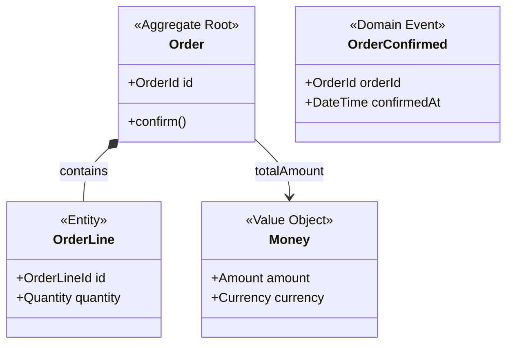
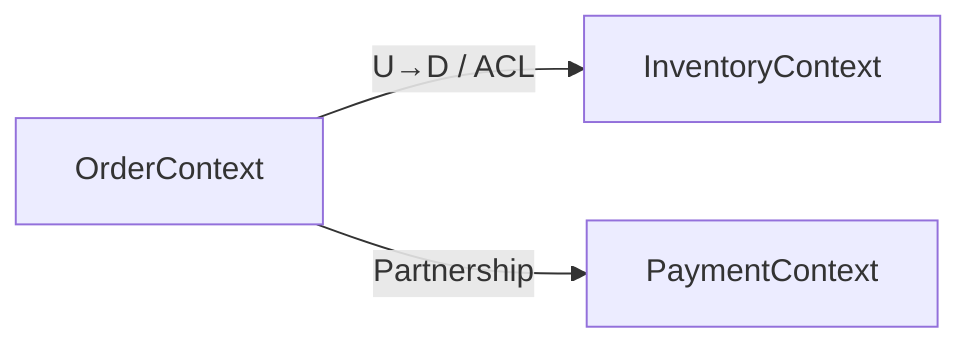

# Research: DDD ドメインモデル管理スキル

**Date**: 2026-05-09

---

## Decision 1: Mermaid classDiagram での DDD 構成要素の表現規約

**Decision**: ステレオタイプ注釈（`<<Aggregate Root>>`/`<<Entity>>`/`<<Value Object>>`/`<<Domain Event>>`）を使い、集約境界は集約ルートからのコンポジション関係（`*--`）で表現する。

**Rationale**: Mermaid classDiagram は UML クラス図のサブセットであり、ステレオタイプが DDD 標準の表記方法（Evans, Vaughn Vernon とも一致）。コンポジション `*--` は集約内包含を、関連 `-->` は参照を表す。

**Alternatives considered**:
- ノートコメントで構成要素を表記 → 視認性が低い
- 色分けのみ（Mermaid の `classDef`）→ GitHub / Claude Code の renderer が対応しない場合があるため補助的に使用

**規約**:



---

## Decision 2: 受動収集の検出パターン

**Decision**: skill-draft.md のパターン表をベースに採用。偽陽性は「キューに積むだけで即提示しない」設計で吸収する。

**Rationale**: UL スキルと同様に、キュー積み＋バッチ提示の設計を取ることで、誤検知があっても会話が中断されない。ユーザーは提示時に拒否できる。

| パターン | 例 | trigger_type |
|---|---|---|
| 「〇〇は〇〇を持つ」「〇〇に属する」「〇〇を集約する」 | 「注文は複数の明細を持つ」 | `aggregate` |
| 「〇〇ID」「〇〇番号」「〇〇コード」で一意識別 | 「注文IDで一意に識別される」 | `entity` |
| 「変更されない」「置き換えられる」「同値なら同一」 | 「住所は変更されない」 | `value-object` |
| 動詞+名詞の過去形/受動形（≠ UL の "業務イベント" 全般） | 「注文が確定された」 | `domain-event` |
| 「〜の場合は〜できない」「〜でなければならない」「〜は必ず〜」 | 「在庫がゼロの場合は注文できない」 | `invariant` |

**偽陽性リスクと対策**: 「〜を持つ」は日常表現にも多い。対策として、直前文脈がドメイン語彙を含む場合のみ候補化する（UL に登録済み語彙 or 先行する DDD パターンが同ターンにある場合）。

**Alternatives considered**:
- 正規表現による厳密マッチング → スキルが Markdown であるためルールは自然言語で記述し、Claude の言語理解に委ねる

---

## Decision 3: Bootstrap 時の質問順序

**Decision**: 集約 → エンティティ・値オブジェクト（同時） → ドメインイベント → 不変条件 の順。

**Rationale**: DDD の設計実践（Evans "Domain-Driven Design", Vaughn Vernon "IDDD"）において、集約の境界を先に定めることでエンティティと VO の帰属が決まる。ドメインイベントはライフサイクルの結果として出現するため後。不変条件は最後に「この集約が常に守るべき条件は？」と確認する。

**Bootstrap フロー**:

1. **集約の発見**: 「このコンテキストで整合性の単位（まとめて変わるもの）は何ですか？例：注文、請求書、カート」
2. **エンティティと VO の分類**: 集約ルート配下の概念を「識別子で区別するか（Entity）、値で区別するか（VO）」で分類
3. **ドメインイベントの列挙**: 「この集約のライフサイクルで起きる業務上の出来事は？（UL に登録済みの場合はそちらを参照）」
4. **不変条件の確認**: 「この集約が常に守らなければならないビジネスルールは？（〜の場合は〜できない等）」

---

## Decision 4: `index.md` のコンテキスト間関係図形式

**Decision**: **Mermaid graph LR** を採用。テーブル形式は補足として併用する。

**Rationale**: Mermaid graph は関係の方向性（上流/下流、ACL の有無）を視覚的に表現できる。テーブルは関係の詳細（統合パターン名）を記述するのに適しており、図と表の役割分担が明確。

**DDD コンテキストマップ統合パターンの表記**:

```
U (Upstream) / D (Downstream)
ACL (Anti-Corruption Layer)
OHS (Open Host Service)
CF (Conformist)
P (Partnership)
```



**Alternatives considered**:
- コンテキストマップ専用テーブルのみ → 関係の方向性が見えにくい
- context-map.md を別ファイルにする → UL スキルがすでに `docs/context-map.md` を持つ。ドメインモデルの `index.md` にコンテキスト間関係を内包することで `docs/context-map.md` との重複を避ける（UL の context-map.md は語彙衝突管理、domain-model の index.md は構造的関係管理と役割分離）

---

## Decision 5: CLAUDE.md へのスキル登録トリガー

**Decision**: UL スキルに隣接するエントリとして追記。トリガー文言は「DDD 語彙を含む設計議論」。

**既存 CLAUDE.md の skills セクション** (`.claude/CLAUDE.md` L13-20):

```
- `coder` — requests involving code implementation ...
- `editor` — requests involving documents ...
- `clarifier` — requests with any ambiguity ...
- `ubiquitous-language` — activate when conversation contains business event expressions ...
```

**追記する行**:

```
- `domain-model` — activate when conversation contains DDD structural patterns (aggregates, entities, value objects, domain events, invariants) or when user asks to create/update a domain model; passively queues candidates; surfaces at natural pauses
```

**Rationale**: UL スキルと同じ受動収集パターンを踏襲。「ドメインモデルを作って」のような明示要求と、会話中の DDD 語彙検出の両方で活性化する。
